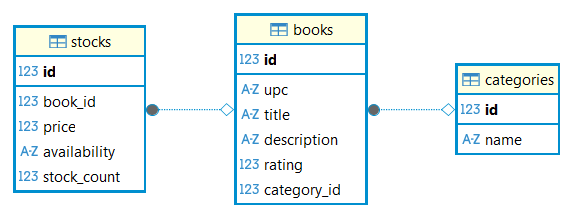

[](https://choosealicense.com/licenses/mit/)


# 📚 Books To Scrape - Projet de Web Scraping

## Description
Ce projet est un système automatisé de collecte de données depuis le site [Books to Scrape](https://books.toscrape.com/). Il extrait les informations détaillées des livres, les stocke dans une base de données PostgreSQL et fournit une interface FastAPI pour accéder aux données.

*Projet réalisé dans le contexte de la formation Développeur IA chez Simplon Hauts-de-France*

## 🛠️ Technologies Utilisées
- **Python 3.13**
- **Scrapy** : Framework de web scraping
- **FastAPI** : Framework API REST
- **PostgreSQL** : Base de données relationnelle
- **SQLAlchemy** : ORM (Object-Relational Mapping)
- **Uvicorn** : Serveur ASGI pour FastAPI

## 🏗️ Structure du Projet
```
Exercice_Scrapy/
│
├── api/                    # Code de l'API FastAPI
│   └── app/
│       ├── routers/       # Routes API
│       ├── crud.py        # Opérations CRUD
│       ├── database.py    # Connexion à la BDD
│       ├── main.py        # Porte d'entrée de l'API
│       ├── models.py      # Modèles SQLAlchemy
│       └── schemas.py     # Schémas Pydantic
│
├── scrapy_books/          # Projet Scrapy
│   └── scrapy_books/
│       ├── spiders/       # Spiders Scrapy
│       ├── itemloaders.py # Extraction et nettoyage des données
│       ├── items.py       # Structure des données
│       ├── middlewares.py # Gestion requêtes/réponses HTTP
│       ├── pipelines.py   # Pipelines de traitement
│       └── settings.py    # Paramètres de Scrapy
│
├── notebooks/
│   └── queries.ipynb      # Requêtes SQL de tests vers la BDD
│
├── .env                   # Variables d'environnement
└── run_project.py         # Script d'exécution du projet
```

## 📋 Prérequis
- Python 3.13 ou supérieur
- PostgreSQL 15 ou supérieur
- pip (gestionnaire de paquets Python)

## 🚀 Installation

1. **Cloner le repository**
```bash
git clone https://github.com/Aurelien-L/Exercice_Scrapy.git
cd Exercice_Scrapy
```

2. **Créer un environnement virtuel**
```bash
python -m venv .venv
.\.venv\Scripts\activate
```

3. **Installer les dépendances**
```bash
pip install -r requirements.txt
```

4. **Configurer les variables d'environnement**  
Créer un fichier `.env` à la racine du projet en suivant la structure du  `.env.example`.  
Utiliser le `START_URL` *all pages* pour extraire la totalité des livres du site, ou l'autre lien pour faire un test avec les deux dernières pages uniquement.

## 🎯 Utilisation

1. **Lancer le projet complet**
```bash
python run_project.py
```
Cette commande va :
- Créer la base de données si elle n'existe pas
- Créer les tables nécessaires
- Lancer le scraping des données
- Démarrer l'API FastAPI

>[!WARNING]
>Assurez-vous d'avoir *PostgreSQL* d'installé sur votre machine (obligatoire).

2. **Accéder à l'API**
- Documentation Swagger UI : http://localhost:8000/docs

## 📌 Points d'accès API

- `GET /books/...` : Informations sur les livres
- `GET /categories/...` : Informations sur les catégories
- `GET /stats/...` : Informations statistiques

## 💾 Schéma de la base de données

  

## 📝 Licence
Ce projet est sous licence MIT. Voir le fichier `LICENSE` pour plus de détails.

## 👤 Auteur
[ @Aurelien-L ](https://github.com/Aurelien-L)